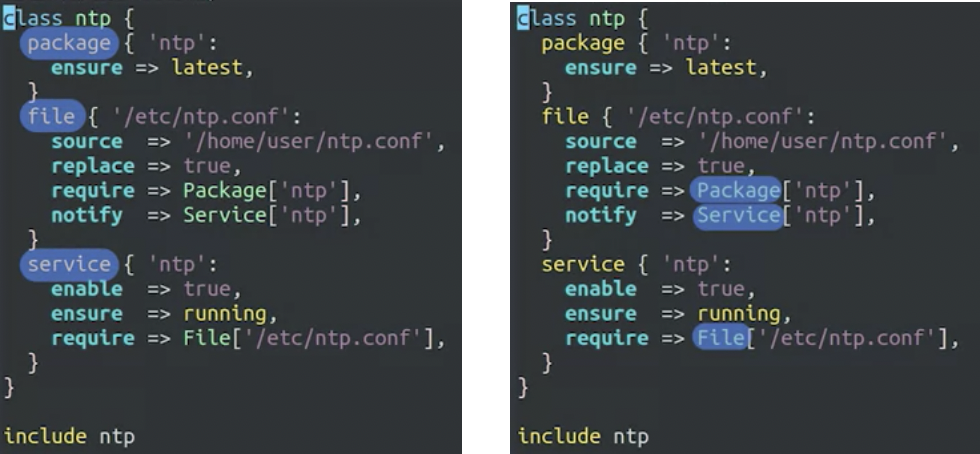
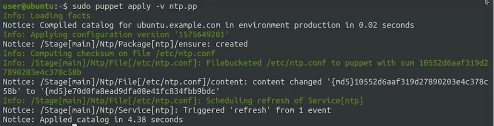
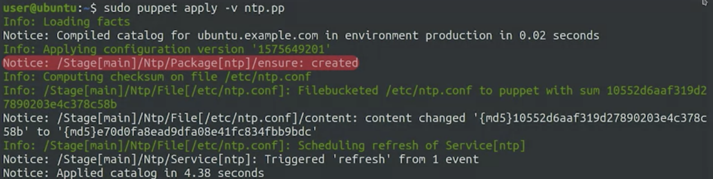
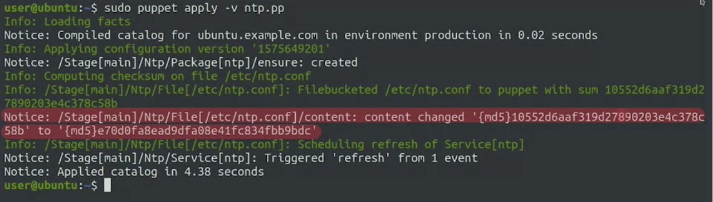
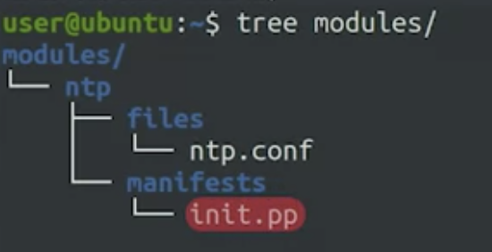

# Configuration Management and the Cloud - Week 2

## Learning Objectives

Dive deeper into baisc congfiguration management concepts and Puppet by:

* Learn how to install Puppet on your computer and how to use a simple test setup to check your rules work as expected
* Learn how to configure the typical client-server set-up with Puppet clients connecting and authenticating to the Puppet server to get the rules that they should apply
* Learn how to use testing techniques and releasing best practices to safely deploy changes to clients of our configuration management system

## Deploying Puppet Locally

### Applying Rules Locally

The **manifest** is a file with .pp extention where we'll store the rules that we want to apply.

Checkout tools.pp file as an example.
```shell
# This example uses Puppet to make sure that htop is installed on each computer for debugging

# htop package is a tool similar to top that shows some extra information
package { 'htop':
  # ensures that the package is present on a computer
  ensure => present,
}

# Run the rules using 'sudo puppet apply -v tools.pp'
# The -v flag tells Puppet that we want to get verbose output
```

The **catalog** is the list of rules that are generated for one specific computer once the server has evaluated all variables, conditionals, and functions.

### Managing Resource Relationships
The Puppet manifests that we use to manage computers in our fleet usually includes a bunch of different resources that are related to each other. You're not going to configure a package that's not installed and you don't want to start a service until both the package and the configuration are in place. 

Puppets lets us control this with resource relationships. Let's check this example bellow ```ntp.pp```. 

- a class with three resources related to the Network Time Protocol, or NTP
- rules make sure that the NTP package is always upgraded to the latest version

```shell
class ntp {
    package { 'ntp':
        ensure => latest,
    }
    file { '/etc/ntp.conf':
        source => 'puppet:///modules/ntp/ntp.conf',
        replace => true,
        require => Package['ntp'],
        notify => Service['ntp'],
    }
    service { 'ntp':
        enable => true,
        ensure => running,
        require => File['/etc/ntp.conf'],
    }
}

include ntp
# Run the rules using 'sudo puppet apply -v ntp.pp'
```

- We see that the configuration file requires the NTP package and the service requires the configuration file. This way, Puppet knows that before starting the service, the configuration file ```/etc/ntp.conf``` needs to be correctly set (it can be downloaded from ```puppet:///modules/ntp/ntp.conf```), and before sending the configuration file, the package needs to be installed. 

```shell
...
    package { 'ntp':
        ensure => latest,
    }
    file { '/etc/ntp.conf':
        source => 'puppet:///modules/ntp/ntp.conf',
        replace => true,
        require => Package['ntp'],
...
    }
    service { 'ntp':
...
        require => File['/etc/ntp.conf'],
    }
}
...
```

- We're also declaring that the NTP service should be notified if the configuration file changes. That way, if we make additional changes to the content of the configuration file in the future, the service will get reloaded with the new settings. 

```shell
...
        notify => Service['ntp'],
...
```

- The resources types are written in lowercase, but relationships like require or notify use uppercase for the first letter of the resources. This is part of Puppet syntax: We write resource types in lowercase when declaring them, but capitalize when referring to them from another resource's attribute.  



- On the bottom of the file, we have a call to include NTP, that's why we told Puppet that we want to apply the rules described in a class. For this example, we put the definition of the class and the call to this class in the same file. Typically the class is defined in one file and include it in another one.

Let's apply these rules locally and we can see a bunch of things. 



- First, it installed the package.



- Then, it checked that the configuration file needed to be updated and so it changed its contents. 



- Finally, after changing the contents of the configuration, Puppet knew to restart the NTP service. 

We've seen how we can apply a Puppet manifests that includes a class with a bunch of resources. We grouped all of the information related to NTP service in a manifest specific to it - which it's common practice when dealing with Puppet rules. We want to keep related operations together and separate things that are unrelated. Up next, we'll look into how we can organize Puppet rules by using Puppet modules. 

### Organize Puppet Modules

In any configuration management deployment, there's usually a lot of different things to manage. We might want to install some packages, copy some configuration files, start some services, schedule some periodic tasks, make sure some users and groups are created and have access to specific devices and maybe execute some commands that aren't provided by existing resources. 

In puppet, manifests are organized into **modules**. A module is a collection of manifests and associated data. We can have a module for everything related to monitoring the computer's health, another one for setting up the network stack, and yet another one for configuring a web serving application. 
- The module ship the manifest in the associated data. All manifests get stored in a directory called **Manifests**. Manifests directory which stores manifest and ```init.pp`` where it defines a class with the same name as the created module
- **Templates** directory which stores any files preprocessed that stores rules or values to be used/replaced after calculating the manifests or section only present if certain condidtions are valid;
- The **Files** directory includes files that are copied into the client machines without any changes like the ```ntp.conf```

Example of ntp class turned into module:



- init.pp include the NTP class that we saw before; 
- ntp.conf file that gets deployed onto the machine is now stored in the file directory; 

Modules can look pretty much the same no matter who's using them. System administrators, by using puppet, have shared the modules they've written letting others use the same rules. By now, there are a lot of prepackaged modules that are shipped and ready to use, we can just install it on our Puppet server and use it in our deployments. 

Example of installing the Apache module provided by Puppet Labs to setup a Apache Web Server on our own computer. 

```Shell
sudo apt install puppet-module-puppetlabs-apache
# by default, the content of the module is stored in /usr/share/puppet/modules.available/puppetlabs-apache/
```

A manifest file ```webserver.pp``` include the module we've just installed. The double colons let's puppet know that this is a global module. 

```
include ::apache
```

After running ```sudo puppet apply -v webserver.pp```, we have a Apache server configured and ready to run on this machine. 

### More Information About Deploying Puppet Locally

Check out the following links for more information:

- https://puppet.com/docs/puppet/latest/style_guide.html
- https://puppet.com/docs/puppetserver/latest/install_from_packages.html

### Some quiz
1. Puppet evaluates all functions, conditionals, and variables for each individual system, and generates a list of rules for that specific system. What are these individual lists of rules called?  
- Catalogs
2. After we install new modules that were made and shared by others, which folder in the module's directory will contain the new functions and facts?
- lib
3. What file extension do manifest files use?
- .pp
4. What is contained in the metadata.json file of a Puppet module?
- Additional data about the module
5. What does Puppet syntax dictate we do when referring to another resource attribute?
- Capitalize the attribute

## Deploying Puppet to Clients

### Puppet Nodes

When managing fleets of computers, we usually want some rules to apply to every computers, and other rules to apply only to a subset of systems. 

For example of managing all your servers with Puppet, you might want to install a basic set of tools on all of them, but only install the packages for serving web pages in your web servers and only install the packages for sending and receiving email in your mail servers. There's a bunch of different ways that we can do this. 
- Conditionally apply some rules using facts from the machines; 
- Use separate ```node definitions```

In Puppet terminoloy, a node is any system where we can run a Puppet agent. It could be a physical workstation, a server, a virtual machine, or even a network router, as long as it has a Puppet agent and can apply the given rules. We can set up Puppet to give some basic rules to all the nodes, but then apply some specific rules to the nodes that we want to be different. 

When setting up Puppet, we usually have a default node definition that lists the classes that should be included for all the nodes. Below example is the default node with two classes, the sudo class and the ntp class.

```puppet
node default {
    class { 'sudo': }
    # sets an additional servers parameter which can be used to get the network time
    class { 'ntp':
            servers => [ 'ntp1.example.com', 'ntp2.example.com' ]
    }
}
```

If you want some settings to only apply to some specific nodes, you can add more node definitions that list the classes that you want them to include. 

Below example shows how specific nodes in the fleet are identified by their FQDNs (fully qualified domain names).

```puppet
node webserver.example.com {
    class { 'sudo': }
    # sets an additional servers parameter which can be used to get the network time
    class { 'ntp':
            servers => [ 'ntp1.example.com', 'ntp2.example.com' ]
    }
    class { 'apache': }
}
```
- In this case, we have the node definition for a host called webserver.example.com; 
- For this node, we're including the same sudo and ntp classes and we're adding the apache class on top; 
- We're listing the same classes because the classes included in the default node definition are only applied to the nodes that don't have an explicit entry. When a node requests which rules it should apply, Puppet will look at the node definitions, figure out which one matches the node's FQDN, and then give only those rules. 

To avoid repeating the inclusion of all the common classes, we might define a base class that does the work of including all the classes that are common to all node types. 

The node definitions are typically stored in a file called site.pp, which isn't part of any module. Instead, it just defines what classes will be included for what nodes. This is another step towards helping us organize our code in a way that makes it easier to maintain. Up next, we'll look into the infrastructure used by Puppet to verify if a node really has the name that it claims to have. 

### Puppet's Certificate Infrastructure

