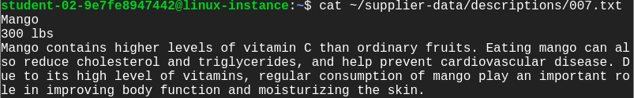
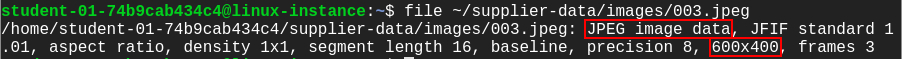
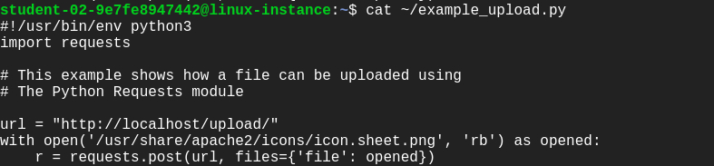
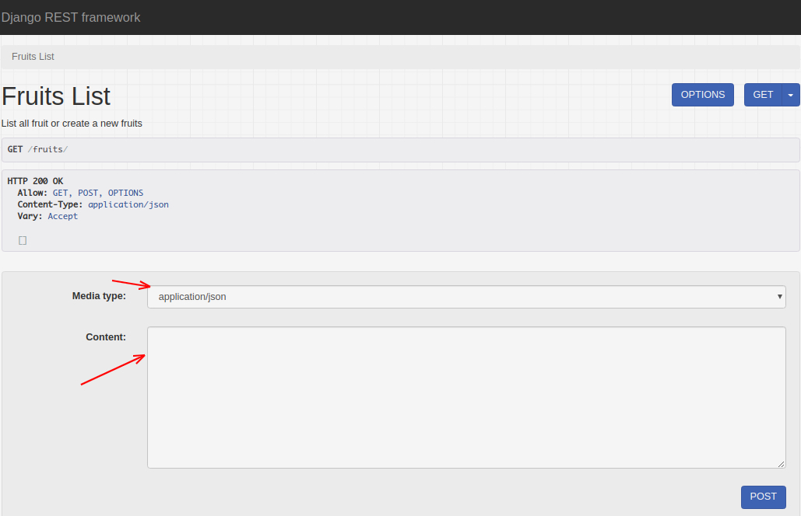

# Automate updating catalog information

You work for an online fruits store, and you need to develop a system that will update the catalog information with data provided by your suppliers. The suppliers send the data as large images with an associated description of the products in two files (.TIF for the image and .txt for the description). The images need to be converted to smaller jpeg images and the text needs to be turned into an HTML file that shows the image and the product description. The contents of the HTML file need to be uploaded to a web service that is already running using Django. You also need to gather the name and weight of all fruits from the .txt files and use a Python request to upload it to your Django server.

You will create a Python script that will process the images and descriptions and then update your company's online website to add the new products.

Once the task is complete, the supplier should be notified with an email that indicates the total weight of fruit (in lbs) that were uploaded. The email should have a PDF attached with the name of the fruit and its total weight (in lbs).

Finally, in parallel to the automation running, we want to check the health of the system and send an email if something goes wrong.

## What you'll do

- Write a script that summarizes and processes sales data into different categories
- Generate a PDF using Python
- Automatically send a PDF by email
- Write a script to check the health status of the system

## Fetching supplier data

You'll first need to get the information from the supplier that is currently stored in a Google Drive file. The supplier has sent data as large images with an associated description of the products in two files (.TIF for the image and .txt for the description).

Here, you'll find two script files ``download_drive_file.sh`` and the ``example_upload.py`` files. To download the file from the supplier onto our linux-instance virtual machine we will first grant executable permission to the download_drive_file.sh script.

```shell
ls ~/
# download_drive_file.sh example_upload.py
sudo chmod +x ~/download_drive_file.sh
./download_drive_file.sh 1LePo57dJcgzoK4uiI_48S01Etck7w_5f supplier-data.tar.gz
```

You have now downloaded a file named supplier-data.tar.gz containing the supplier's data. Let's extract the contents from this file using the following command:

```shell
tar xf ~/supplier-data.tar.gz
```

This creates a directory named supplier-data, that contains subdirectories named images and descriptions.

```shell
ls ~/supplier-data
# descriptions images
```

The subdirectory ``images`` contain images of various fruits, while the ``descriptions`` subdirectory has text files containing the description of each fruit. You can have a look at any of these text files using cat command.

```shell
cat ~/supplier-data/descriptions/007.txt
```

Output:



The first line contains the name of the fruit followed by the weight of the fruit and finally the description of the fruit.

## Working with supplier images

In this section, you will write a Python script named changeImage.py to process the supplier images. You will be using the PIL library to update all images within ~/supplier-data/images directory to the following specifications:

- **Size**: Change image resolution from **3000x2000** to **600x400** pixel
- **Format**: Change image format from **.TIFF** to **.JPEG**

Create and open the file using nano editor.

```shell
nano ~/changeImage.py
```

> Note: The raw images from images subdirectory contains alpha transparency layers. So, it is better to first convert RGBA 4-channel format to RGB 3-channel format before processing the images. Use convert("RGB") method for converting RGBA to RGB image.

After processing the images, save them in the same path ```~/supplier-data/images```, with a JPEG extension.

Now, let's check the specifications of the images you just updated. Open any image using the following command:

```shell
file ~/supplier-data/images/003.jpeg
```

Output:



## Uploading images to web server

You have modified the fruit images through ``changeImage.py ``script. Now, you will have to upload these modified images to the web server that is handling the fruit catalog. To do that, you'll have to use the Python requests module to send the file contents to the ``[linux-instance-IP-Address]/upload URL``.

Copy the external IP address of your instance from the Connection Details Panel on the left side and enter the IP address in a new web browser tab. This opens a web page displaying the text "Fruit Catalog".

In the home directory, you'll have a script named ``example_upload.py`` to upload images to the running fruit catalog web server. To view the example_upload.py script use the cat command.

```shell
cat ~/example_upload.py
```

Output:


In this script, we are going to upload a sample image named icon.sheet.png. In a similar way, you are going to write a script named ```supplier_image_upload.py``` that takes the jpeg images from the supplier-data/images directory that you've processed previously and uploads them to the web server fruit catalog. Use the nano editor to create a file named ```supplier_image_upload.py```.

```shell
nano ~/supplier_image_upload.py
```

## Uploading the descriptions

The Django server is already set up to show the fruit catalog for your company. You can visit the main website by entering ```linux-instance-IP-Address```. The interface looks like this:


You can check out the Django REST framework, by navigating to ```linux-instance-IP-Address/fruits``` in your browser.



To add fruit images and their descriptions from the supplier on the fruit catalog web-server, create a new Python script that will automatically POST the fruit images and their respective description in JSON format.

Write a Python script named ```run.py``` to process the text files (001.txt, 003.txt ...) from the ```supplier-data/descriptions``` directory. The script should turn the data into a JSON dictionary by adding all the required fields, including the image associated with the fruit (image_name), and uploading it to http://[linux-instance-external-IP]/fruits using the Python requests library.

Now, you'll have to process the .txt files (named 001.txt, 002.txt, ...) in the ```supplier-data/descriptions/``` directory and save them in a data structure so that you can then upload them via JSON. Note that all files are written in the following format, with each piece of information on its own line:

- name
- weight (in lbs)
- description

The data model in the Django application fruit has the following fields: name, weight, description and image_name. The weight field is defined as an integer field. So when you process the weight information of the fruit from the .txt file, you need to convert it into an integer. For example if the weight is "500 lbs", you need to drop "lbs" and convert "500" to an integer.

The image_name field will allow the system to find the image associated with the fruit. Don't forget to add all fields, including the image_name! The final JSON object should be similar to:

```json
{"name": "Watermelon", "weight": 500, "description": "Watermelon is good for relieving heat, eliminating annoyance and quenching thirst. It contains a lot of water, which is good for relieving the symptoms of acute fever immediately. The sugar and salt contained in watermelon can diuretic and eliminate kidney inflammation. Watermelon also contains substances that can lower blood pressure.", "image_name": "010.jpeg"}
```

Iterate over all the fruits and use post method from Python requests library to upload all the data to the URL http://[linux-instance-external-IP]/fruits

## Generate a PDF report and send it through email

Once the images and descriptions have been uploaded to the fruit store web-server, you will have to generate a PDF file to send to the supplier, indicating that the data was correctly processed. To generate PDF reports, you can use the ReportLab library. The content of the report should look like this:

```
Processed Update on <Today's date>

[blank line]

name: Apple

weight: 500 lbs

[blank line]

name: Avocado

weight: 200 lbs

[blank line]

...
```

### Script to generate a PDF report

Create a script ```reports.py``` to generate PDF report to supplier. Using the reportlab Python library, define the method ```generate_report``` to build the PDF reports. You will need to pass the following arguments to the reports.generate_report method: the text description processed from the text files as the paragraph argument, the report title as the title argument, and the file path of the PDF to be generated as the attachment argument (use ‘/tmp/processed.pdf')

```python
reports.generate_report(attachment, title, paragraph)
```
